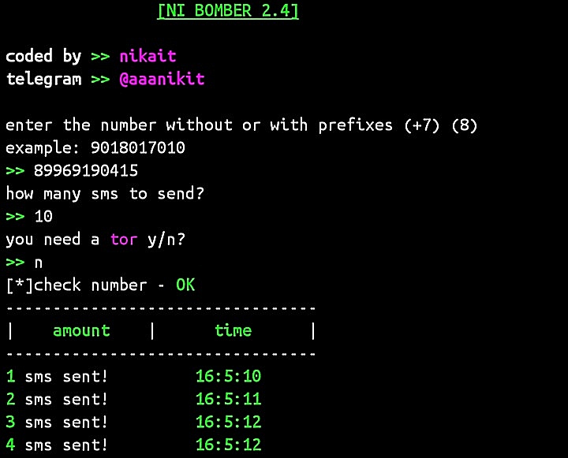

#  ni_bomber

 
<b>Hey!</b>
This is a small sms bomber,
the number of sms sent per second depends on the speed
of your internet.  
If you use this bomber at the same time by several people, 
you can easily put the phone!

upd:
Действует только по русским номерам

# Install
git clone https://github.com/Nikait/ni_bomber

cd ni_bomber

pip install requests

pip install requests[socks]

python ni_bomber.py

Relax! 

#  Donate

    monero: 
    48TmwHGVsqSKgD7giTALoK7P2muKLTJn5R8s5XtKZL1jEr4MJFBAwczVtofuFGvzsT1CzTcFXotwZCDno1UsskqFFZe9wVC
***
    bitcoin:
    18LKUKWAUBAFKzLBdFFkt687vh8rMPhL1u
***
    ethereum:
    0x189a9436b2fbBd0b1C3927E8a398379DBb7105AA
